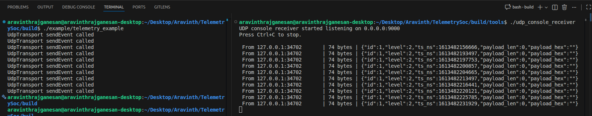

# Telemetry4SoC

Telemetry4SoC is a lightweight telemetry framework written in C/C++ for System-on-Chip (SoC) projects. It provides a lock-free ring buffer to store events, a background service to process events, and transport adapters to send data to different destinations.

## Features
- **Fixed-size events**: Each event includes a payload, priority level, and timestamp.
- **Thread-safe buffer**: A ring buffer that multiple threads can use safely; tracks dropped events.
- **Background service**: Automatically processes events in a separate thread.
- **Transport options**: Easy-to-use interface for sending data over UDP, mock transport, or custom transports.
- **UDP support**: Sends events as JSON to a specified address and port.
- **OS abstraction**: Works with different operating systems (Linux implementations included).
- **Example program**: Demonstrates how to use the framework.
- **Unit tests**: Includes tests for core components.

## Project Organization
- `core/` - Event structure, ring buffer, and memory utilities.
- `agent/` - Background service that processes events from the ring buffer.
- `transport/` - Different ways to send events (interfaces and implementations).
- `os/` - Operating system abstraction layer; includes Linux support.
- `api/` - Public interfaces for using the framework (currently includes placeholder headers).
- `example/` - Sample application showing how to use the framework.
- `tests/` - Automated tests for the core components.

## Build
**Requirements**: CMake 3.10 or later, C11/C++17 support, pthread library (Linux).

**Build steps**:
```bash
mkdir -p build
cmake -S . -B build
cmake --build build
```

### Build Options
You can customize the build by enabling or disabling certain components:
- `TELEMETRY_BUILD_EXAMPLES` (default: ON) - Include the example program
- `TELEMETRY_BUILD_TESTS` (default: ON) - Include the unit tests

**Example**: Build without tests
```bash
cmake -S . -B build -DTELEMETRY_BUILD_TESTS=OFF
cmake --build build
```

## Run
**Run the example program**:
```bash
./build/example/telemetry_example
```

**Run the unit tests**:
```bash
./build/tests/test_telemetry_framework
```

## Quick Test with UDP
This section shows how to test the framework using UDP transport on your local machine.

**Step 1**: Build the project
```bash
cmake -S . -B build
cmake --build build
```

**Step 2**: Start a UDP listener (choose one option below)
```bash
nc -u -l 9000
```
or
```bash
socat -u UDP-RECV:9000 STDOUT
```

**Step 3**: Run the example in a different terminal
```bash
./build/example/telemetry_example
```

You should see JSON-formatted events appear in the listener window.

## Running Pre-compiled Programs
If you have already built the project, you can run the programs directly:

**Run the example**:
```bash
./build/example/telemetry_example
```

**Run with UDP receiver**:
```bash
./path/to/udp_console_receiver
./build/example/telemetry_example
```

**Example output**:


## Usage Example
Here is a simple example of how to use the framework in your code:

```cpp
// Create and initialize the ring buffer
ring_buffer_t* rb = nullptr;
ring_buffer_init(&rb, 1024);

// Set up UDP transport
transport::UdpTransport udp;
transport::Config cfg{};
cfg.endpoint = "127.0.0.1:9000";
cfg.mtu = 512;
udp.Init(cfg);

// Create a C-compatible transport adapter
transport_c_t c_transport = transport_adapter::make_transport_adapter(udp);

// Start the background service
telemetry_agent_t* agent = nullptr;
telemetry_agent_start(&agent, rb, &c_transport);

// Create and send an event
telemetry_event_t ev{};
ev.event_id = 1;
ev.level = TELEMETRY_LEVEL_INFO;
ev.payload_size = 0;
ev.timestamp = osal_telemetry_now_monotonic_ns();

ring_buffer_push(rb, &ev);
telemetry_agent_notify(agent);

// Clean up
telemetry_agent_stop(agent);
udp.shutdown();
ring_buffer_free(rb);
```

## Current Status
- ✅ **UDP transport**: Fully implemented with JSON event formatting and socket communication.
- ✅ **Example program**: Works with UDP transport to demonstrate the framework.
- ✅ **Mock transport**: Available for testing without sending data over the network.
- 📋 **API headers**: `api/telemetry.hpp`, `api/config.hpp`, and `api/telemetry.cpp` are placeholders for future development.
- 📋 **Memory pool**: Files in `core/` are placeholder implementations.
- ✅ **Tests**: Currently cover events and ring buffer functionality.
